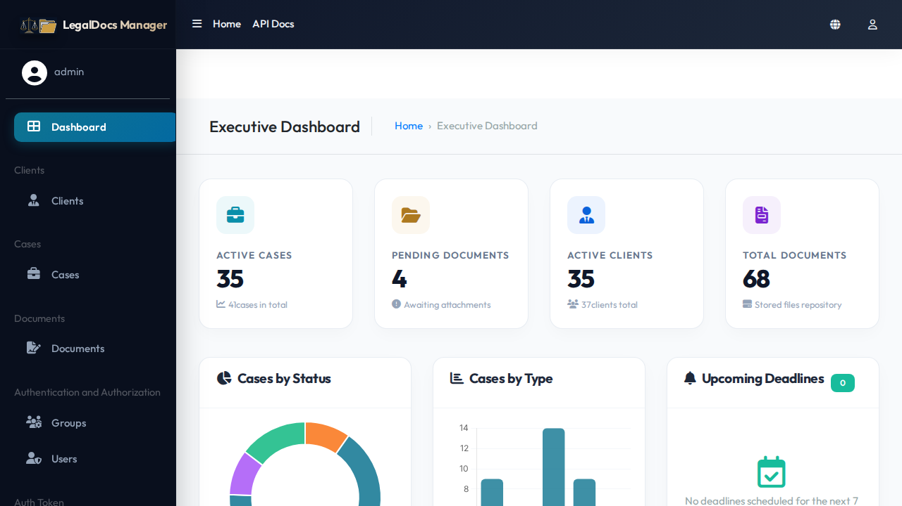
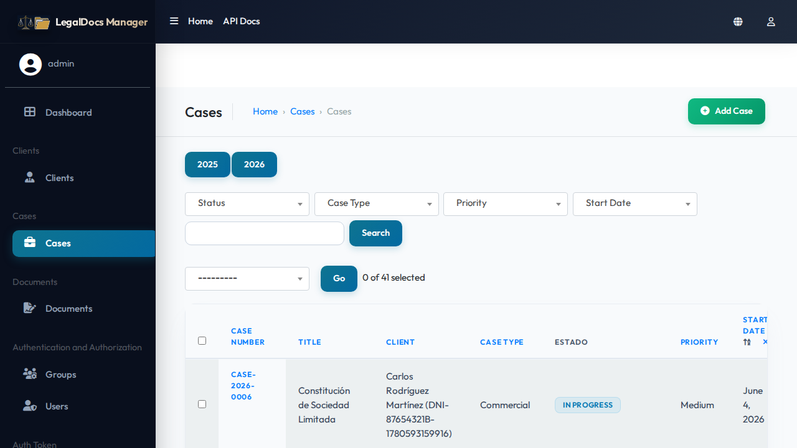
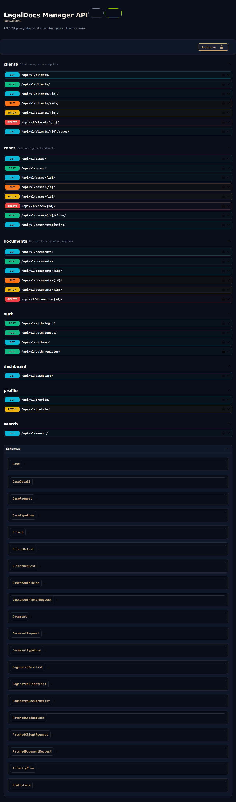
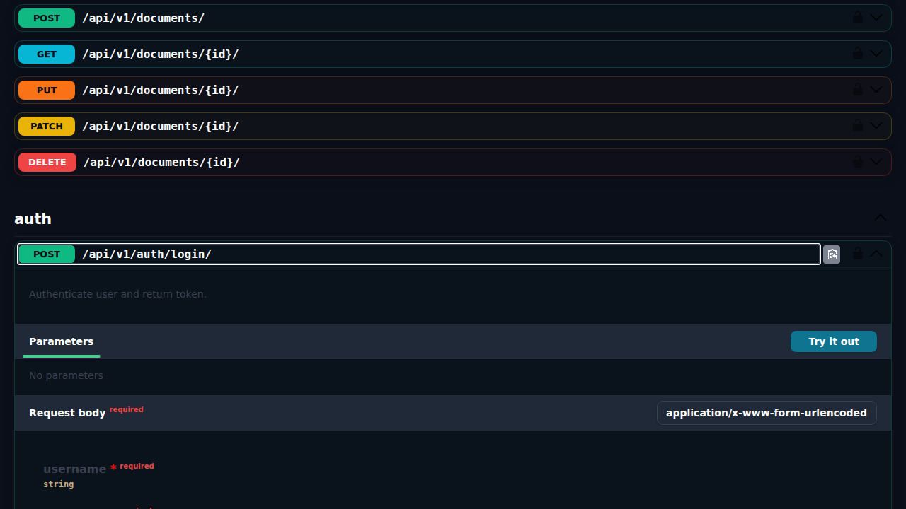
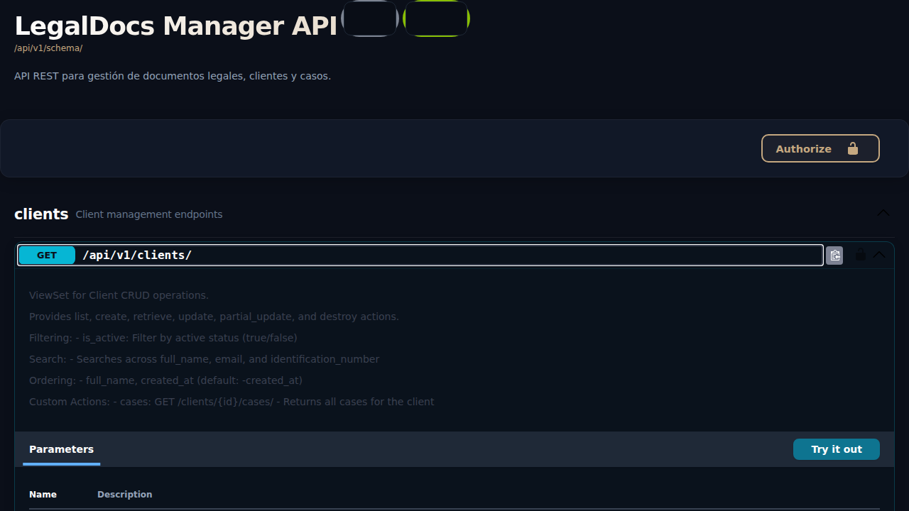
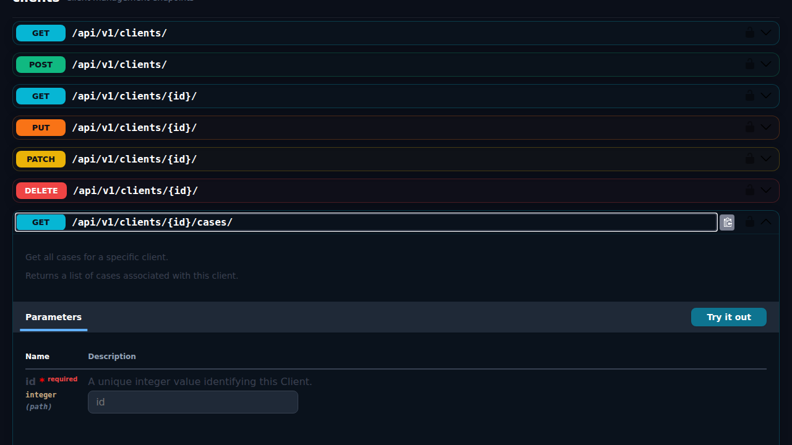
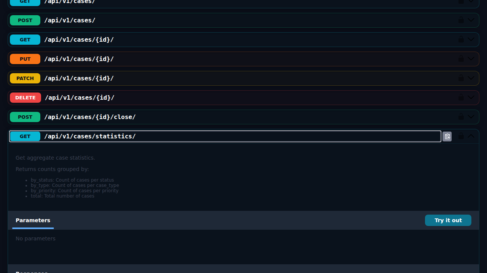
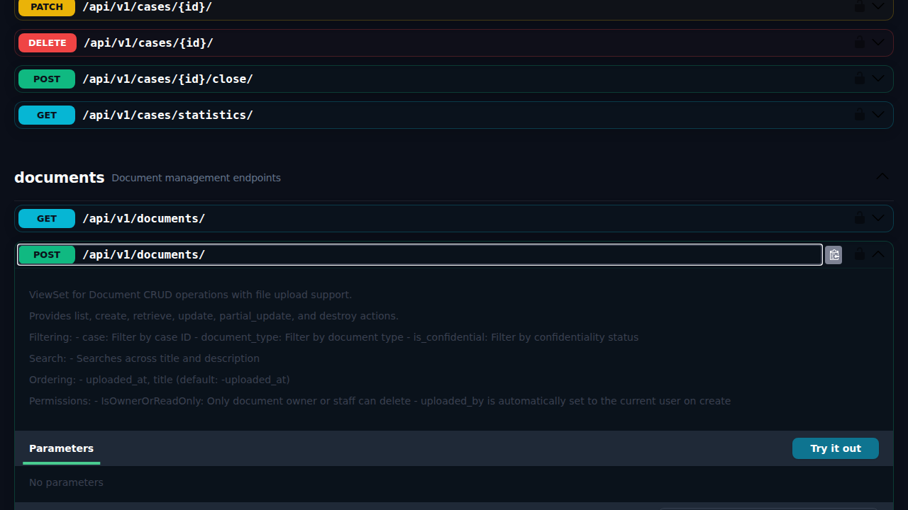
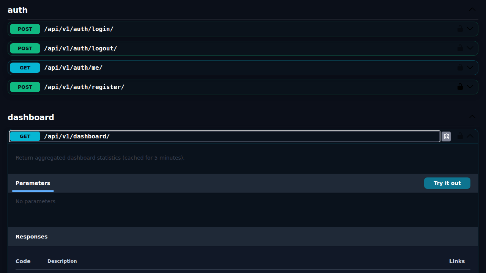

<div align="center">


# LegalDocs Manager

🇺🇸 [English](#english) | 🇪🇸 [Español](#español)

[](https://www.python.org/)
[](https://www.djangoproject.com/)
[](https://www.django-rest-framework.org/)
[](https://www.docker.com/)
[](https://www.postgresql.org/)
[](https://nginx.org/)

[](LICENSE)
[](https://github.com/hooperits/LegalDocs-Manager)
[](https://github.com/hooperits/LegalDocs-Manager)

**A comprehensive legal document management system built with Django REST Framework**

**Sistema integral de gestión de documentos legales construido con Django REST Framework**

</div>

---

<a name="english"></a>

## 🇺🇸 English

[🇪🇸 Cambiar a Español](#español)

A comprehensive legal document management system designed to help law firms and legal professionals manage clients, cases, and documents efficiently.

### Table of Contents

- [Features](#features)
- [Screenshots](#screenshots)
- [Tech Stack](#tech-stack)
- [Quick Start](#quick-start)
- [Installation](#installation)
- [Running with Docker (Recommended)](#running-with-docker-recommended)
- [Environment Variables](#environment-variables)
- [Database Setup](#database-setup)
- [Running Tests](#running-tests)
- [Demo Data](#demo-data)
- [API Reference](#api-reference)
- [Project Structure](#project-structure)
- [Contributing](#contributing)
- [License](#license)

---

### Features

- 👥 **Client Management**: Track client information, contact details, and associated cases
- ⚖️ **Case Management**: Handle legal cases with status tracking, priorities, and automatic case number generation
- 📄 **Document Management**: Upload, organize, and manage legal documents with confidentiality controls
- 📊 **Dashboard**: Real-time statistics and overview of active cases
- 🔍 **Search**: Global search across clients, cases, and documents
- 🔐 **User Authentication**: Token-based authentication with registration, login, and profile management
- 📚 **API Documentation**: Interactive Swagger UI documentation
- 🎨 **Premium Theme & Branding**: Customized AdminLTE UI via django-jazzmin featuring a custom Windows-style folder & scales logo, matching favicon, corrected layout spacing, and a luxury glassmorphism login screen

---

### Screenshots

<details>
<summary>📸 View Screenshots</summary>

#### Django Admin



*Powerful admin interface for advanced management*



*Case management in Django Admin with status badges*

#### Swagger API Documentation



*Interactive API documentation with Swagger UI*

#### Authentication



*Secure token-based authentication*

#### Client Management



*Complete CRUD operations for managing legal clients*

#### Case Management



*Track legal cases with status and priority filters*



*Real-time case statistics and analytics*

#### Document Management



*Upload and manage legal documents with file validation*

#### Dashboard & Search



*Real-time statistics and global search functionality*

</details>

> 📸 **[View all screenshots →](docs/screenshots/README.md)**

---

### Tech Stack

| Category | Technology |
|----------|------------|
| **Backend** | Python 3.11+, Django 5.x, Django REST Framework 3.15+ |
| **Database** | PostgreSQL 15+ (SQLite for development/testing) |
| **Authentication** | Token Authentication (DRF) |
| **API Documentation** | drf-spectacular (OpenAPI 3.0) |
| **Testing** | Django TestCase, DRF APITestCase, coverage.py |

---

### Quick Start

```bash
# 1. Clone the repository
git clone https://github.com/hooperits/LegalDocs-Manager.git
cd LegalDocs-Manager

# 2. Create virtual environment
python -m venv venv
source venv/bin/activate  # Windows: venv\Scripts\activate

# 3. Install dependencies
pip install -r requirements.txt

# 4. Setup database
cd legaldocs
python manage.py migrate
python manage.py createsuperuser

# 5. Run the server
python manage.py runserver
```

Visit: **http://localhost:8000/api/v1/docs/**

---

### Installation

#### Prerequisites

- Python 3.11 or higher
- PostgreSQL 15+ (optional, SQLite works for development)
- pip (Python package manager)

#### Step-by-Step Setup

1. **Clone the repository**

   ```bash
   git clone https://github.com/hooperits/LegalDocs-Manager.git
   cd LegalDocs-Manager
   ```

2. **Create a virtual environment**

   ```bash
   python -m venv venv
   source venv/bin/activate  # On Windows: venv\Scripts\activate
   ```

3. **Install dependencies**

   ```bash
   pip install -r requirements.txt
   ```

4. **Configure environment variables**

   ```bash
   cp .env.example .env
   ```

   Edit `.env` with your settings (see [Environment Variables](#environment-variables)).

5. **Run database migrations**

   ```bash
   cd legaldocs
   python manage.py migrate
   ```

6. **Create a superuser** (optional)

   ```bash
   python manage.py createsuperuser
   ```

7. **Run the development server**

   ```bash
   python manage.py runserver
   ```

    The API will be available at `http://localhost:8000/api/v1/`

---

### Running with Docker (Recommended)

Docker Compose allows you to launch the entire stack—including the database and pre-installed OS utilities—with a single command. It is the easiest and most robust way to run the project.

> [!TIP]
> The Docker setup installs all required system-level packages (like `libmagic` for secure mime-type detection) automatically, preventing compatibility issues on different operating systems.

#### 1. Development Mode (with hot-reloading & auto-loaded demo data)

Runs the application using Django's development server. Code changes inside the `legaldocs` folder will trigger automatic reloading.

```bash
# Clone the repository (if not already done)
git clone https://github.com/hooperits/LegalDocs-Manager.git
cd LegalDocs-Manager

# Start development containers
docker compose up --build
```

- The script will wait for the Postgres container, apply database migrations, and load **demo data** automatically.
- **API Documentation**: [http://localhost:8000/api/v1/docs/](http://localhost:8000/api/v1/docs/)
- **Django Admin**: [http://localhost:8000/admin/](http://localhost:8000/admin/)
- **MinIO Object Storage Console**: [http://localhost:9001](http://localhost:9001) (user: `minioadmin`, password: `minioadminsecure`)
  - A private bucket named `legaldocs-media` is automatically created on startup.
  - To test file uploads locally using MinIO, set `USE_S3=True` in your `.env` file.


#### 2. Production Mode (Gunicorn + Nginx + PostgreSQL + SSL/TLS)

Simulates production architecture with secure SSL/TLS. Nginx serves as a reverse proxy on ports 80 and 443, automatically redirects all HTTP traffic to HTTPS, and directly delivers static and media assets.

**Prerequisites**:
- Set `DOMAIN_NAME` and `CERTBOT_EMAIL` in your `.env` file (see `.env.example`).
- For local testing, set `DOMAIN_NAME=localhost`.

**Initial Setup (Provisioning SSL Certificates)**:
Run the bootstrap script to generate temporary certificates, start Nginx, and request Let's Encrypt certificates (or use local self-signed mode):
```bash
# For local testing (using self-signed certificates on localhost)
./init-ssl.sh

# For production (using Let's Encrypt certificates)
./init-ssl.sh

# For production testing (using Let's Encrypt Staging environment to avoid rate limits)
./init-ssl.sh --staging
```

Once provisioned:
- **API Documentation (Secure)**: [https://localhost/api/v1/docs/](https://localhost/api/v1/docs/) (or your domain)
- **Django Admin (Secure)**: [https://localhost/admin/](https://localhost/admin/)

> [!NOTE]
> The `certbot` container runs in the background and automatically checks for renewal every 12 hours. Nginx is configured to reload every 24 hours to dynamically pick up renewed certificates.

#### 3. Running Unit Tests in Docker

Run the test suite within the running web service container:

```bash
docker compose exec web python manage.py test
```

---

### Environment Variables

| Variable | Description | Default |
|----------|-------------|---------|
| `SECRET_KEY` | Django secret key | Required in production |
| `DEBUG` | Enable debug mode | `False` |
| `ALLOWED_HOSTS` | Comma-separated list of allowed hosts | `localhost,127.0.0.1` |
| `DB_NAME` | Database name | `legaldocs_db` |
| `DB_USER` | Database user | `legaldocs_user` |
| `DB_PASSWORD` | Database password | Required |
| `DB_HOST` | Database host | `localhost` |
| `DB_PORT` | Database port | `5432` |
| `USE_S3` | Enable S3/MinIO object storage for media files | `False` |
| `AWS_ACCESS_KEY_ID` | Access key credential for S3/MinIO | Required if `USE_S3=True` |
| `AWS_SECRET_ACCESS_KEY` | Secret key credential for S3/MinIO | Required if `USE_S3=True` |
| `AWS_STORAGE_BUCKET_NAME` | S3 bucket name for uploads | Required if `USE_S3=True` |
| `AWS_S3_ENDPOINT_URL` | Public endpoint URL (host-accessible) | Required if `USE_S3=True` |
| `AWS_S3_ENDPOINT_URL_INTERNAL` | Internal container network endpoint URL | Optional (MinIO only) |
| `AWS_S3_REGION_NAME` | S3 Region name | `us-east-1` |

#### Example .env file

```env
SECRET_KEY=your-secret-key-here
DEBUG=True
ALLOWED_HOSTS=localhost,127.0.0.1
DB_NAME=legaldocs_db
DB_USER=legaldocs_user
DB_PASSWORD=your-password
DB_HOST=localhost
DB_PORT=5432

# Object Storage Configuration
USE_S3=False
AWS_ACCESS_KEY_ID=minioadmin
AWS_SECRET_ACCESS_KEY=minioadminsecure
AWS_STORAGE_BUCKET_NAME=legaldocs-media
AWS_S3_ENDPOINT_URL=http://localhost:9000
AWS_S3_ENDPOINT_URL_INTERNAL=http://minio:9000
AWS_S3_REGION_NAME=us-east-1
```

---

### Database Setup

#### PostgreSQL (Production)

1. **Install PostgreSQL**

   ```bash
   # Ubuntu/Debian
   sudo apt install postgresql postgresql-contrib

   # macOS with Homebrew
   brew install postgresql
   ```

2. **Create database and user**

   ```sql
   CREATE DATABASE legaldocs_db;
   CREATE USER legaldocs_user WITH PASSWORD 'your-password';
   ALTER ROLE legaldocs_user SET client_encoding TO 'utf8';
   ALTER ROLE legaldocs_user SET default_transaction_isolation TO 'read committed';
   ALTER ROLE legaldocs_user SET timezone TO 'UTC';
   GRANT ALL PRIVILEGES ON DATABASE legaldocs_db TO legaldocs_user;
   ```

#### SQLite (Development)

SQLite is automatically used during tests. For local development with SQLite, modify `settings.py` or set environment variables accordingly.

---

### Running Tests

Run the full test suite:

```bash
cd legaldocs
python manage.py test
```

Run tests for specific apps:

```bash
python manage.py test clients cases documents
```

Run tests with verbose output:

```bash
python manage.py test --verbosity=2
```

#### Test Coverage

```bash
coverage run --source='clients,cases,documents,api' manage.py test
coverage report
coverage html  # Generate HTML report in htmlcov/
```

Current coverage: **98%** | Tests passing: **172**

---

### Demo Data

Load demo data with realistic legal scenarios:

```bash
python manage.py load_demo_data
```

This creates:
- 20+ clients with Spanish names
- 30+ legal cases across different types
- 50+ documents

To clear and reload demo data:

```bash
python manage.py load_demo_data --clear
```

---

### API Reference

All endpoints are prefixed with `/api/v1/`

#### Authentication

| Endpoint | Method | Description |
|----------|--------|-------------|
| `/api/v1/auth/register/` | POST | Register new user |
| `/api/v1/auth/login/` | POST | Login and get token |
| `/api/v1/auth/logout/` | POST | Logout and invalidate token |
| `/api/v1/auth/me/` | GET | Get current user info |

#### Clients

| Endpoint | Method | Description |
|----------|--------|-------------|
| `/api/v1/clients/` | GET | List all clients |
| `/api/v1/clients/` | POST | Create a client |
| `/api/v1/clients/{id}/` | GET | Get client details |
| `/api/v1/clients/{id}/` | PUT/PATCH | Update client |
| `/api/v1/clients/{id}/` | DELETE | Delete client |
| `/api/v1/clients/{id}/cases/` | GET | Get client's cases |

#### Cases

| Endpoint | Method | Description |
|----------|--------|-------------|
| `/api/v1/cases/` | GET | List all cases |
| `/api/v1/cases/` | POST | Create a case |
| `/api/v1/cases/{id}/` | GET | Get case details |
| `/api/v1/cases/{id}/` | PUT/PATCH | Update case |
| `/api/v1/cases/{id}/` | DELETE | Delete case |
| `/api/v1/cases/{id}/close/` | POST | Close a case |
| `/api/v1/cases/statistics/` | GET | Get case statistics |

#### Documents

| Endpoint | Method | Description |
|----------|--------|-------------|
| `/api/v1/documents/` | GET | List all documents |
| `/api/v1/documents/` | POST | Upload a document |
| `/api/v1/documents/{id}/` | GET | Get document details |
| `/api/v1/documents/{id}/` | PUT/PATCH | Update document |
| `/api/v1/documents/{id}/` | DELETE | Delete document |

#### Other Endpoints

| Endpoint | Method | Description |
|----------|--------|-------------|
| `/api/v1/dashboard/` | GET | Dashboard statistics |
| `/api/v1/search/` | GET | Global search |
| `/api/v1/profile/` | GET/PATCH | User profile |

#### API Documentation

- **OpenAPI Schema**: `/api/v1/schema/`
- **Swagger UI**: `/api/v1/docs/`

> 📖 **[View detailed API documentation →](API_DOCS.md)**

---

### Project Structure

```
LegalDocs-Manager/
├── legaldocs/            # Django project root directory
│   ├── api/              # API views, authentication, permissions
│   ├── cases/            # Case model, views, serializers
│   ├── clients/          # Client model, views, serializers
│   ├── core/             # Core utilities, management commands
│   ├── documents/        # Document model, views, serializers
│   ├── fixtures/         # Demo data fixtures
│   ├── legaldocs/        # Django settings
│   └── manage.py
├── docs/
│   └── screenshots/      # Application screenshots
├── nginx/
│   └── default.conf      # Nginx proxy configuration
├── tests/
│   └── e2e/              # Playwright E2E tests
├── Dockerfile            # Docker configuration
├── docker-compose.yml    # Dev Docker Compose environment
├── docker-compose.prod.yml # Production Docker Compose environment
├── requirements.txt      # Python dependencies
└── README.md             # Project documentation
```

---

### Contributing

1. **Fork the repository**
2. **Create a feature branch** from `main`
   ```bash
   git checkout -b feature/your-feature-name
   ```
3. **Write tests** for new functionality
4. **Ensure all tests pass** with 70%+ coverage
   ```bash
   python manage.py test
   coverage report
   ```
5. **Commit your changes** (use Spanish commit messages per project convention)
   ```bash
   git commit -m "feat(module): descripción del cambio"
   ```
6. **Push to your branch**
   ```bash
   git push origin feature/your-feature-name
   ```
7. **Submit a pull request**

#### Commit Message Format

- `feat(scope): new feature`
- `fix(scope): bug fix`
- `docs(scope): documentation`
- `refactor(scope): code refactoring`
- `test(scope): tests`

---

### License

This project is licensed under the MIT License - see the [LICENSE](LICENSE) file for details.

---

<div align="center">

# 🇪🇸 Español

[🇺🇸 Switch to English](#english)

</div>

<a name="español"></a>

[](https://www.python.org/)
[](https://www.djangoproject.com/)
[](https://www.postgresql.org/)
[](LICENSE)

Sistema integral de gestión de documentos legales diseñado para ayudar a bufetes de abogados y profesionales legales a gestionar clientes, casos y documentos de manera eficiente.

### Tabla de Contenidos

- [Características](#características)
- [Capturas de Pantalla](#capturas-de-pantalla)
- [Stack Tecnológico](#stack-tecnológico)
- [Inicio Rápido](#inicio-rápido)
- [Instalación](#instalación)
- [Ejecución con Docker (Recomendado)](#ejecución-con-docker-recomendado)
- [Variables de Entorno](#variables-de-entorno)
- [Configuración de Base de Datos](#configuración-de-base-de-datos)
- [Ejecutar Tests](#ejecutar-tests)
- [Datos de Demostración](#datos-de-demostración)
- [Referencia API](#referencia-api)
- [Estructura del Proyecto](#estructura-del-proyecto)
- [Contribuir](#contribuir)
- [Licencia](#licencia)

---

### Características

- 👥 **Gestión de Clientes**: Seguimiento de información de clientes, datos de contacto y casos asociados
- ⚖️ **Gestión de Casos**: Manejo de casos legales con seguimiento de estado, prioridades y generación automática de número de caso
- 📄 **Gestión de Documentos**: Carga, organización y gestión de documentos legales con controles de confidencialidad
- 📊 **Panel de Control**: Estadísticas en tiempo real y resumen de casos activos
- 🔍 **Búsqueda**: Búsqueda global en clientes, casos y documentos
- 🔐 **Autenticación de Usuarios**: Autenticación basada en token con registro, inicio de sesión y gestión de perfil
- 📚 **Documentación API**: Documentación interactiva con Swagger UI
- 🎨 **Tema y Branding Premium**: Interfaz AdminLTE personalizada con django-jazzmin que incluye un logotipo personalizado de carpeta estilo Windows y balanza de la justicia, favicon a juego, espaciado de interfaz optimizado y pantalla de login de lujo con efecto glassmorphism

---

### Capturas de Pantalla

<details>
<summary>📸 Ver Capturas</summary>

#### Administración Django


*Potente interfaz de administración para gestión avanzada*


*Gestión de casos en Django Admin con badges de estado*

#### Documentación API Swagger


*Documentación interactiva de la API con Swagger UI*

#### Autenticación


*Autenticación segura basada en token*

#### Gestión de Clientes


*Operaciones CRUD completas para gestionar clientes legales*

#### Gestión de Casos


*Seguimiento de casos legales con filtros de estado y prioridad*


*Estadísticas y análisis de casos en tiempo real*

#### Gestión de Documentos


*Carga y gestión de documentos legales con validación de archivos*

#### Panel y Búsqueda


*Estadísticas en tiempo real y funcionalidad de búsqueda global*

</details>

> 📸 **[Ver todas las capturas →](docs/screenshots/README.md)**

---

### Stack Tecnológico

| Categoría | Tecnología |
|-----------|------------|
| **Backend** | Python 3.11+, Django 5.x, Django REST Framework 3.15+ |
| **Base de Datos** | PostgreSQL 15+ (SQLite para desarrollo/testing) |
| **Autenticación** | Token Authentication (DRF) |
| **Documentación API** | drf-spectacular (OpenAPI 3.0) |
| **Testing** | Django TestCase, DRF APITestCase, coverage.py |

---

### Inicio Rápido

```bash
# 1. Clonar el repositorio
git clone https://github.com/hooperits/LegalDocs-Manager.git
cd LegalDocs-Manager

# 2. Crear entorno virtual
python -m venv venv
source venv/bin/activate  # Windows: venv\Scripts\activate

# 3. Instalar dependencias
pip install -r requirements.txt

# 4. Configurar base de datos
cd legaldocs
python manage.py migrate
python manage.py createsuperuser

# 5. Ejecutar el servidor
python manage.py runserver
```

Visitar: **http://localhost:8000/api/v1/docs/**

---

### Instalación

#### Prerrequisitos

- Python 3.11 o superior
- PostgreSQL 15+ (opcional, SQLite funciona para desarrollo)
- pip (gestor de paquetes de Python)

#### Configuración Paso a Paso

1. **Clonar el repositorio**

   ```bash
   git clone https://github.com/hooperits/LegalDocs-Manager.git
   cd LegalDocs-Manager
   ```

2. **Crear un entorno virtual**

   ```bash
   python -m venv venv
   source venv/bin/activate  # En Windows: venv\Scripts\activate
   ```

3. **Instalar dependencias**

   ```bash
   pip install -r requirements.txt
   ```

4. **Configurar variables de entorno**

   ```bash
   cp .env.example .env
   ```

   Editar `.env` con tu configuración (ver [Variables de Entorno](#variables-de-entorno)).

5. **Ejecutar migraciones**

   ```bash
   cd legaldocs
   python manage.py migrate
   ```

6. **Crear un superusuario** (opcional)

   ```bash
   python manage.py createsuperuser
   ```

7. **Ejecutar el servidor de desarrollo**

   ```bash
   python manage.py runserver
   ```

    La API estará disponible en `http://localhost:8000/api/v1/`

---

### Ejecución con Docker (Recomendado)

Docker Compose te permite levantar la arquitectura completa (base de datos y dependencias del sistema preinstaladas) con un solo comando. Es el método recomendado para ejecutar el proyecto de forma robusta.

> [!TIP]
> El entorno Docker instala automáticamente todas las librerías a nivel de sistema operativo necesarias (como `libmagic` para la validación de archivos), evitando problemas de compatibilidad y dependencias rotas en tu máquina local.

#### 1. Modo de Desarrollo (con recarga en vivo y carga automática de datos)

Utiliza el servidor de desarrollo nativo de Django. Los cambios que realices en el código dentro de la carpeta `legaldocs` se reflejarán inmediatamente.

##### **Paso 1: Levantar los contenedores de desarrollo**
Inicia todos los servicios (PostgreSQL, Redis, Django y MinIO) ejecutando:
```bash
docker compose up --build
```
*El script de inicio esperará automáticamente al contenedor de Postgres, aplicará las migraciones y cargará los **datos de demostración** (25 clientes, 35 casos y 60 documentos).*

##### **Paso 2: Crear una cuenta de Administrador**
Para iniciar sesión en el panel de control o usar las APIs autenticadas, abre una nueva pestaña en tu terminal y crea un superusuario dentro del contenedor web:
```bash
docker compose exec web python manage.py createsuperuser
```
Sigue las instrucciones interactivas en pantalla para configurar tu usuario, correo y contraseña.

##### **Paso 3: Explorar y Probar la Aplicación**

*   **Documentación Interactiva de la API (Swagger UI)**:
    👉 **[http://localhost:8000/api/v1/docs/](http://localhost:8000/api/v1/docs/)**
    *Nota: La ruta raíz (`/`) devolverá un error **404 (Not Found)** por diseño, ya que no tiene ninguna vista asociada. Utiliza siempre `/api/v1/docs/` para interactuar con la API. Puedes iniciar sesión en la documentación usando el botón **Authorize** tras obtener un token en `/api/v1/auth/token/` (usa el formato `Token <tu-token-aqui>`).*
*   **Panel de Administración de Django**:
    👉 **[http://localhost:8000/admin/](http://localhost:8000/admin/)**
    Inicia sesión con las credenciales que creaste en el **Paso 2** para visualizar y gestionar los registros de clientes, casos y documentos cargados en el sistema.
*   **Consola de Almacenamiento MinIO**:
    👉 **[http://localhost:9001](http://localhost:9001)**
    *   **Usuario**: `minioadmin`
    *   **Contraseña**: `minioadminsecure`
    Un bucket privado llamado `legaldocs-media` se crea automáticamente. Para habilitar y probar la subida de archivos adjuntos localmente hacia MinIO, asegúrate de establecer `USE_S3=True` en tu archivo `.env`.

##### **Paso 4: Detener los servicios**
Para apagar los contenedores y liberar los puertos, presiona `Ctrl + C` en la terminal donde se ejecuta Docker Compose, o escribe en tu consola:
```bash
docker compose down
```

#### 2. Modo de Producción (Gunicorn + Nginx + PostgreSQL + SSL/TLS)

Simula la arquitectura de producción real con SSL/TLS seguro. Nginx actúa como un proxy inverso en los puertos 80 y 443, redirige automáticamente el tráfico HTTP a HTTPS, y sirve directamente los archivos estáticos y multimedia.

**Prerrequisitos**:
- Configurar `DOMAIN_NAME` y `CERTBOT_EMAIL` en tu archivo `.env` (ver `.env.example`).
- Para pruebas locales, establece `DOMAIN_NAME=localhost`.

**Configuración Inicial (Aprovisionamiento de Certificados SSL)**:
Ejecuta el script de inicio para generar certificados temporales, iniciar Nginx y solicitar certificados de Let's Encrypt (o usar el modo local autofirmado):
```bash
# Para pruebas locales (usando certificados autofirmados en localhost)
./init-ssl.sh

# Para producción (usando certificados reales de Let's Encrypt)
./init-ssl.sh

# Para pruebas en producción (usando el entorno Staging de Let's Encrypt para evitar límites de tasa)
./init-ssl.sh --staging
```

Una vez aprovisionado:
- **Documentación API (Segura)**: [https://localhost/api/v1/docs/](https://localhost/api/v1/docs/) (o tu dominio)
- **Panel de Administración (Seguro)**: [https://localhost/admin/](https://localhost/admin/)

> [!NOTE]
> El contenedor `certbot` se ejecuta en segundo plano y comprueba la renovación automáticamente cada 12 horas. Nginx está configurado para recargar su configuración cada 24 horas y aplicar dinámicamente los certificados renovados.

#### 3. Copias de Seguridad Automáticas (Database Backups a S3)

El entorno de producción incluye un servicio de copias de seguridad automático (`db-backup`) que realiza volcados diarios de la base de datos:
- **Ejecución Diaria**: Se ejecuta automáticamente todos los días a las **02:00 AM UTC**.
- **Compresión y Carga**: Realiza el volcado (`pg_dump`), lo comprime con `gzip` y lo sube directamente al bucket S3 bajo el prefijo `backups/`.
- **Política de Retención**: Conserva únicamente las copias de seguridad de los últimos **7 días** para controlar el espacio de almacenamiento.

**Ejecutar copia de seguridad manual inmediata**:
```bash
docker compose -f docker-compose.prod.yml run --rm db-backup --now
```

#### 4. Ejecutar Pruebas Unitarias en Docker

Ejecuta la suite de pruebas unitarias dentro del contenedor del servicio web:

```bash
docker compose exec web python manage.py test
```

---

### Variables de Entorno

| Variable | Descripción | Por Defecto |
|----------|-------------|-------------|
| `SECRET_KEY` | Clave secreta de Django | Requerida en producción |
| `DEBUG` | Activar modo debug | `False` |
| `ALLOWED_HOSTS` | Lista separada por comas de hosts permitidos | `localhost,127.0.0.1` |
| `DB_NAME` | Nombre de la base de datos | `legaldocs_db` |
| `DB_USER` | Usuario de la base de datos | `legaldocs_user` |
| `DB_PASSWORD` | Contraseña de la base de datos | Requerida |
| `DB_HOST` | Host de la base de datos | `localhost` |
| `DB_PORT` | Puerto de la base de datos | `5432` |
| `USE_S3` | Activar almacenamiento de objetos S3/MinIO para archivos media | `False` |
| `AWS_ACCESS_KEY_ID` | Clave de acceso de S3/MinIO | Requerida si `USE_S3=True` |
| `AWS_SECRET_ACCESS_KEY` | Clave secreta de S3/MinIO | Requerida si `USE_S3=True` |
| `AWS_STORAGE_BUCKET_NAME` | Nombre del bucket S3 para subidas | Requerida si `USE_S3=True` |
| `AWS_S3_ENDPOINT_URL` | URL del endpoint público (accesible por clientes) | Requerida si `USE_S3=True` |
| `AWS_S3_ENDPOINT_URL_INTERNAL` | URL del endpoint interno en red de contenedores | Opcional (solo MinIO) |
| `AWS_S3_REGION_NAME` | Nombre de la región S3 | `us-east-1` |

#### Ejemplo de archivo .env

```env
SECRET_KEY=tu-clave-secreta-aqui
DEBUG=True
ALLOWED_HOSTS=localhost,127.0.0.1
DB_NAME=legaldocs_db
DB_USER=legaldocs_user
DB_PASSWORD=tu-contraseña
DB_HOST=localhost
DB_PORT=5432

# Configuración de Almacenamiento de Objetos
USE_S3=False
AWS_ACCESS_KEY_ID=minioadmin
AWS_SECRET_ACCESS_KEY=minioadminsecure
AWS_STORAGE_BUCKET_NAME=legaldocs-media
AWS_S3_ENDPOINT_URL=http://localhost:9000
AWS_S3_ENDPOINT_URL_INTERNAL=http://minio:9000
AWS_S3_REGION_NAME=us-east-1
```

---

### Configuración de Base de Datos

#### PostgreSQL (Producción)

1. **Instalar PostgreSQL**

   ```bash
   # Ubuntu/Debian
   sudo apt install postgresql postgresql-contrib

   # macOS con Homebrew
   brew install postgresql
   ```

2. **Crear base de datos y usuario**

   ```sql
   CREATE DATABASE legaldocs_db;
   CREATE USER legaldocs_user WITH PASSWORD 'tu-contraseña';
   ALTER ROLE legaldocs_user SET client_encoding TO 'utf8';
   ALTER ROLE legaldocs_user SET default_transaction_isolation TO 'read committed';
   ALTER ROLE legaldocs_user SET timezone TO 'UTC';
   GRANT ALL PRIVILEGES ON DATABASE legaldocs_db TO legaldocs_user;
   ```

#### SQLite (Desarrollo)

SQLite se usa automáticamente durante los tests. Para desarrollo local con SQLite, modifica `settings.py` o configura las variables de entorno apropiadamente.

---

### Ejecutar Tests

Ejecutar la suite completa de tests:

```bash
cd legaldocs
python manage.py test
```

Ejecutar tests para apps específicas:

```bash
python manage.py test clients cases documents
```

Ejecutar tests con salida detallada:

```bash
python manage.py test --verbosity=2
```

#### Cobertura de Tests

```bash
coverage run --source='clients,cases,documents,api' manage.py test
coverage report
coverage html  # Generar reporte HTML en htmlcov/
```

Cobertura actual: **98%** | Tests pasando: **172**

---

### Datos de Demostración

Cargar datos de demostración con escenarios legales realistas:

```bash
python manage.py load_demo_data
```

Esto crea:
- 20+ clientes con nombres en español
- 30+ casos legales de diferentes tipos
- 50+ documentos

Para limpiar y recargar datos de demostración:

```bash
python manage.py load_demo_data --clear
```

---

### Referencia API

Todos los endpoints tienen el prefijo `/api/v1/`

#### Autenticación

| Endpoint | Método | Descripción |
|----------|--------|-------------|
| `/api/v1/auth/register/` | POST | Registrar nuevo usuario |
| `/api/v1/auth/login/` | POST | Iniciar sesión y obtener token |
| `/api/v1/auth/logout/` | POST | Cerrar sesión e invalidar token |
| `/api/v1/auth/me/` | GET | Obtener información del usuario actual |

#### Clientes

| Endpoint | Método | Descripción |
|----------|--------|-------------|
| `/api/v1/clients/` | GET | Listar todos los clientes |
| `/api/v1/clients/` | POST | Crear un cliente |
| `/api/v1/clients/{id}/` | GET | Obtener detalles del cliente |
| `/api/v1/clients/{id}/` | PUT/PATCH | Actualizar cliente |
| `/api/v1/clients/{id}/` | DELETE | Eliminar cliente |
| `/api/v1/clients/{id}/cases/` | GET | Obtener casos del cliente |

#### Casos

| Endpoint | Método | Descripción |
|----------|--------|-------------|
| `/api/v1/cases/` | GET | Listar todos los casos |
| `/api/v1/cases/` | POST | Crear un caso |
| `/api/v1/cases/{id}/` | GET | Obtener detalles del caso |
| `/api/v1/cases/{id}/` | PUT/PATCH | Actualizar caso |
| `/api/v1/cases/{id}/` | DELETE | Eliminar caso |
| `/api/v1/cases/{id}/close/` | POST | Cerrar un caso |
| `/api/v1/cases/statistics/` | GET | Obtener estadísticas de casos |

#### Documentos

| Endpoint | Método | Descripción |
|----------|--------|-------------|
| `/api/v1/documents/` | GET | Listar todos los documentos |
| `/api/v1/documents/` | POST | Subir un documento |
| `/api/v1/documents/{id}/` | GET | Obtener detalles del documento |
| `/api/v1/documents/{id}/` | PUT/PATCH | Actualizar documento |
| `/api/v1/documents/{id}/` | DELETE | Eliminar documento |

#### Otros Endpoints

| Endpoint | Método | Descripción |
|----------|--------|-------------|
| `/api/v1/dashboard/` | GET | Estadísticas del panel |
| `/api/v1/search/` | GET | Búsqueda global |
| `/api/v1/profile/` | GET/PATCH | Perfil de usuario |

#### Documentación API

- **Esquema OpenAPI**: `/api/v1/schema/`
- **Swagger UI**: `/api/v1/docs/`

> 📖 **[Ver documentación detallada de la API →](API_DOCS.md)**

---

### Estructura del Proyecto

```
LegalDocs-Manager/
├── legaldocs/            # Directorio raíz del proyecto Django
│   ├── api/              # Vistas API, autenticación, permisos
│   ├── cases/            # Modelo, vistas y serializadores de casos
│   ├── clients/          # Modelo, vistas y serializadores de clientes
│   ├── core/             # Utilidades core, comandos de gestión
│   ├── documents/        # Modelo, vistas y serializadores de documentos
│   ├── fixtures/         # Fixtures de datos de demostración
│   ├── legaldocs/        # Configuración de Django
│   └── manage.py
├── docs/
│   └── screenshots/      # Capturas de pantalla de la aplicación
├── nginx/
│   └── default.conf      # Configuración del proxy Nginx para producción
├── specs/                # Especificaciones de características
├── tests/
│   └── e2e/              # Tests E2E con Playwright
├── Dockerfile            # Configuración Docker para el servicio web
├── docker-entrypoint.sh  # Script de inicio y chequeo de base de datos
├── docker-compose.yml    # Entorno Docker Compose de desarrollo
├── docker-compose.prod.yml # Entorno Docker Compose de producción
├── requirements.txt      # Dependencias de Python (incluye Gunicorn)
├── README.md             # Documentación del proyecto
├── API_DOCS.md           # Documentación detallada de la API
└── DEPLOYMENT.md         # Guía de despliegue en producción
```

---

### Contribuir

1. **Hacer fork del repositorio**
2. **Crear una rama de característica** desde `main`
   ```bash
   git checkout -b feature/nombre-de-tu-caracteristica
   ```
3. **Escribir tests** para la nueva funcionalidad
4. **Asegurar que todos los tests pasen** con 70%+ de cobertura
   ```bash
   python manage.py test
   coverage report
   ```
5. **Hacer commit de tus cambios** (usar mensajes de commit en español según convención del proyecto)
   ```bash
   git commit -m "feat(modulo): descripción del cambio"
   ```
6. **Hacer push a tu rama**
   ```bash
   git push origin feature/nombre-de-tu-caracteristica
   ```
7. **Enviar un pull request**

#### Formato de Mensajes de Commit

- `feat(alcance): nueva característica`
- `fix(alcance): corrección de bug`
- `docs(alcance): documentación`
- `refactor(alcance): refactorización de código`
- `test(alcance): tests`

---

### Licencia

Este proyecto está licenciado bajo la Licencia MIT - ver el archivo [LICENSE](LICENSE) para más detalles.

---

<div align="center">

**[⬆ Volver arriba](#legaldocs-manager)** | **[🇺🇸 English](#english)** | **[🇪🇸 Español](#español)**

Made with ❤️ for the legal community

Hecho con ❤️ para la comunidad legal

</div>
